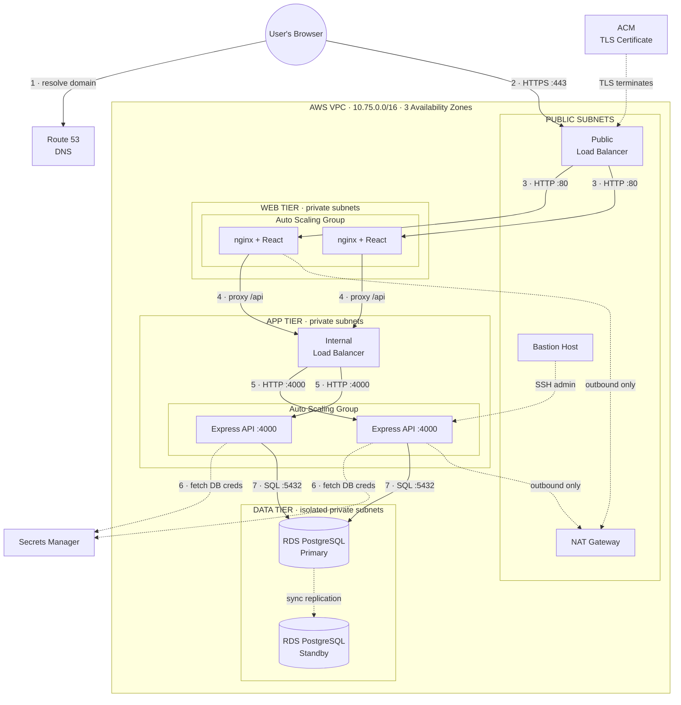
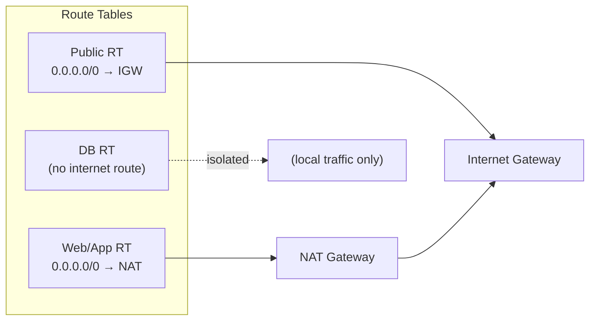
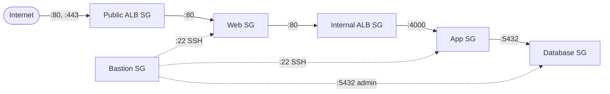
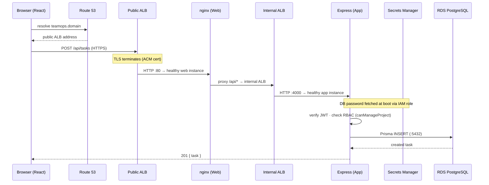
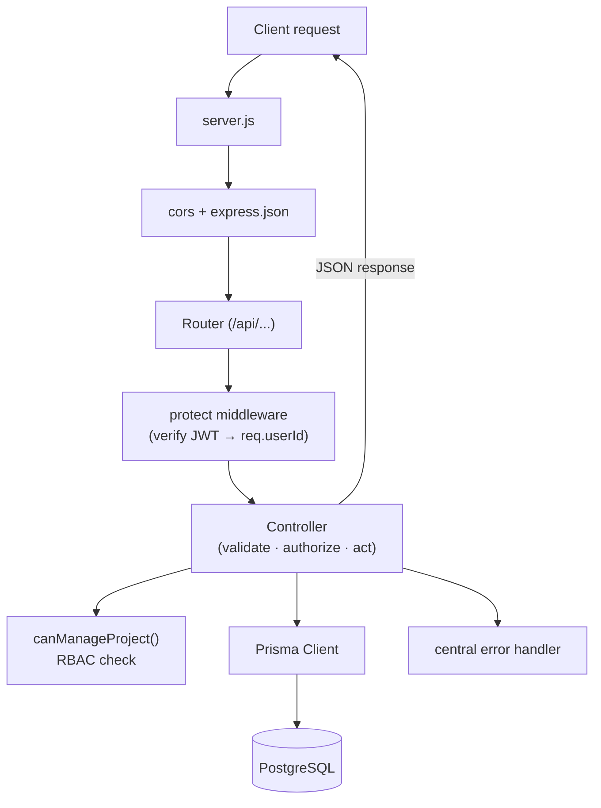
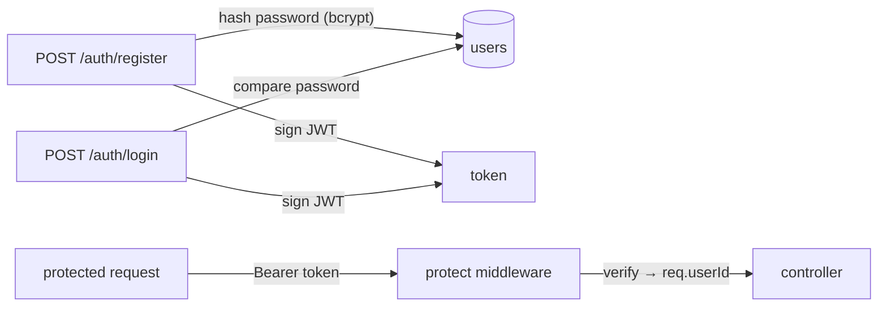
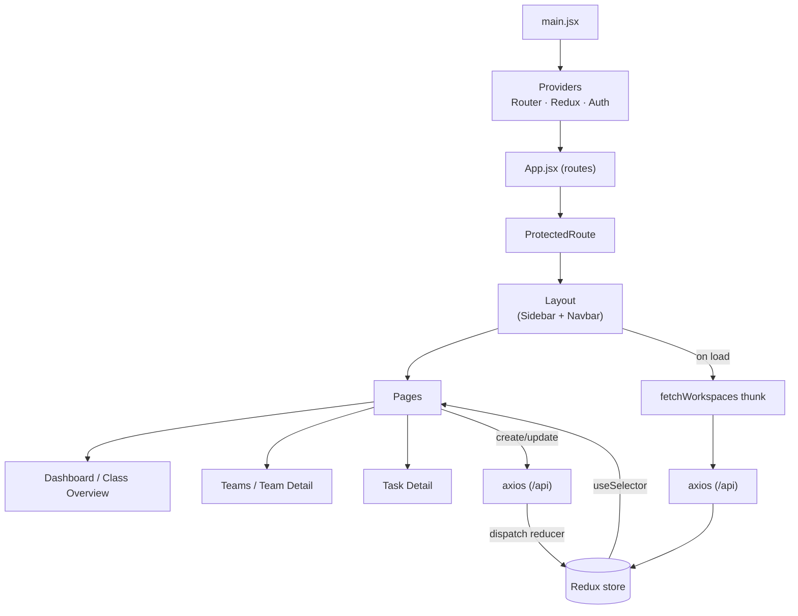
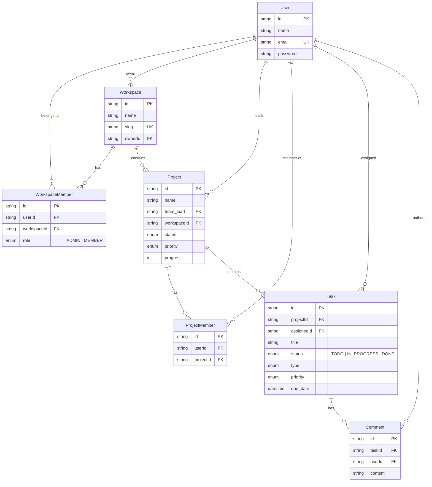
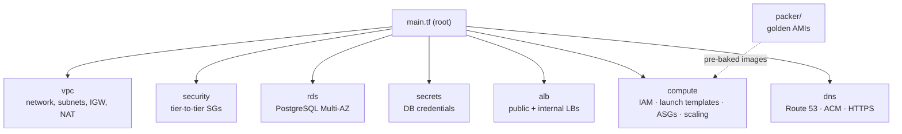

<div align="center">

# TeamOps

**A full-stack classroom project-management platform deployed on a production-grade 3-tier AWS architecture, provisioned end to end with Terraform.**


</div>

---

## Table of Contents

1. [Overview](#overview)
2. [Features](#features)
3. [Tech Stack](#tech-stack)
4. [System Architecture (3-Tier)](#system-architecture-3-tier)
5. [Network Topology](#network-topology)
6. [Security Model](#security-model)
7. [Request Lifecycle](#request-lifecycle)
8. [Backend — Architecture & Flow](#backend--architecture--flow)
9. [Frontend — Architecture & Flow](#frontend--architecture--flow)
10. [Database Schema](#database-schema)
11. [Infrastructure as Code](#infrastructure-as-code)
12. [Local Development](#local-development)
13. [Deploying to AWS](#deploying-to-aws)
14. [Repository Structure](#repository-structure)
15. [Documentation](#documentation)

---

## Overview

TeamOps is a project-management application built for the classroom. A **faculty** member heads a
**class** and orchestrates many student **teams** — appointing team leaders, assigning tasks,
tracking progress, and commenting across every team. Students work within the teams they belong to.

It is deployed the way real production systems are built: three **isolated network tiers** on AWS,
secure by design, highly available, auto-scaling, and defined **entirely as code**.

> The application is the workload. **The infrastructure is the deliverable.**

**Domain model**

| Classroom concept | System entity |
| :--- | :--- |
| Class | Workspace |
| Faculty (class head) | Workspace `ADMIN` |
| Team | Project |
| Team leader | Project `team_lead` |
| Student | Project member |
| Assigned work | Task |
| Discussion | Comment |

---

## Features

**Platform**
- Faculty-orchestrated hierarchy: one class → many teams → tasks → comments
- Layered **role-based access control** (faculty vs. team lead vs. student)
- Kanban task board, calendar view, analytics dashboard, class-wide overview
- Local JWT authentication (register / login / session restore)

**Cloud architecture**
- Custom **VPC**, 12 subnets across 3 Availability Zones
- Tier-to-tier **security groups**, **NAT gateway**, fully isolated database subnets
- **Public + internal load balancers**; self-healing **auto-scaling** web and app tiers
- **Multi-AZ RDS**, **Secrets Manager** + scoped **IAM** roles
- **Route 53** + **ACM** for DNS and HTTPS
- **Packer** golden AMIs for fast instance boot
- 100% **Infrastructure as Code** with Terraform (`apply` builds it, `destroy` removes it)

---

## Tech Stack

| Area | Technologies |
| :--- | :--- |
| **Frontend** | React (Vite), Redux Toolkit, React Router, Tailwind CSS, Axios, Recharts |
| **Backend** | Node.js, Express, Prisma ORM, JSON Web Tokens, bcrypt |
| **Database** | PostgreSQL (AWS RDS, Multi-AZ) |
| **Web server** | nginx (static serving + reverse proxy) |
| **Infrastructure** | Terraform, Packer |
| **AWS** | VPC, EC2, ALB, Auto Scaling, RDS, IAM, Secrets Manager, Route 53, ACM, S3, CloudWatch |
| **Tooling** | Docker, Docker Compose, Git, GitHub |

---

## System Architecture (3-Tier)

Three tiers, each in its own subnets, each reachable only from the tier in front of it.



| Tier | Runs | Subnets | Accepts traffic from | Public IP |
| :--- | :--- | :--- | :--- | :--- |
| **Presentation** | nginx + React build | web private | the public load balancer | No |
| **Application** | Express API | app private | the internal load balancer | No |
| **Data** | PostgreSQL (RDS) | db private (isolated) | the application tier | No |

The browser only ever reaches the public load balancer. The application tier and database have **no
public address and no route from the internet**.

---

## Network Topology

VPC `10.75.0.0/16`, carved into **12 subnets** across **3 Availability Zones**.

| Subnet group | CIDRs | Internet route | Contents |
| :--- | :--- | :--- | :--- |
| **Public** | `10.75.1-3.0/24` | Internet Gateway | Load balancer, bastion, NAT |
| **Web** (private) | `10.75.4-6.0/24` | NAT (outbound only) | nginx + React |
| **App** (private) | `10.75.7-9.0/24` | NAT (outbound only) | Express API + internal ALB |
| **Database** (private) | `10.75.10-12.0/24` | **none** | RDS PostgreSQL |



> **The key idea:** a subnet is *public* only because its route table sends `0.0.0.0/0` to the
> Internet Gateway. There is no "public" switch — it is entirely about routing.

---

## Security Model

Defense in depth. Security groups chain tier-to-tier, each rule referencing the **previous group**
(not IP ranges), so the rules survive auto-scaling as instances come and go.



Additional controls:
- **RDS** is encrypted at rest and `publicly_accessible = false`.
- The **database password** lives in **Secrets Manager** — never in code, config, or the AMI.
- The app tier reads it via an **IAM role scoped to that one secret** (no static AWS keys anywhere).
- **TLS terminates** at the public load balancer (encryption in transit).
- Admin SSH to private instances is **only** through the bastion host.

---

## Request Lifecycle

What happens when a user clicks **Create Task**, end to end.



---

## Backend — Architecture & Flow

A layered Express application: **routes → middleware → controllers → Prisma → PostgreSQL**.



**Folder layout**

```
backend/
├── server.js            # app entry: middleware + route mounting
├── configs/             # prisma client, jwt, password, mailer, db-url seam
├── middlewares/         # protect (auth), asyncHandler, errorHandler
├── routes/              # auth, workspaces, projects, tasks, comments
├── controllers/         # business logic per resource
├── utils/               # permissions (canManageProject), validation
└── prisma/              # schema + migrations + seed
```

**Authentication flow**



**Role-based access control** — a single rule grants faculty their cross-team authority:

> `canManageProject(project, user)` = the project's **team lead** *OR* an **ADMIN** of the project's
> workspace (the faculty). Used by the task, comment, and project controllers.

**API reference**

| Method | Endpoint | Purpose | Who |
| :--- | :--- | :--- | :--- |
| `POST` | `/api/auth/register` | Create account | anyone |
| `POST` | `/api/auth/login` | Log in, get JWT | anyone |
| `GET` | `/api/auth/me` | Current user | authenticated |
| `GET` | `/api/workspaces` | Load classes (nested tree) | member |
| `POST` | `/api/workspaces` | Create a class | authenticated (becomes faculty) |
| `POST` | `/api/workspaces/add-member` | Add a person to a class | faculty |
| `POST` | `/api/projects` | Create a team | faculty |
| `PUT` | `/api/projects` | Update a team | faculty / team lead |
| `POST` | `/api/projects/:id/addMember` | Add student to a team | faculty / team lead |
| `POST` | `/api/tasks` | Create a task | faculty / team lead |
| `PUT` | `/api/tasks/:id` | Update a task (status) | faculty / team lead |
| `POST` | `/api/tasks/delete` | Delete tasks | faculty / team lead |
| `POST` | `/api/comments` | Comment on a task | faculty / team member |
| `GET` | `/api/comments/:taskId` | List comments | member |
| `GET` | `/health` | Load-balancer health check | — |

---

## Frontend — Architecture & Flow

A React SPA. One API call (`GET /api/workspaces`) hydrates the whole UI into Redux; components read
from the store and dispatch writes back through the API.



**Data flow**
- **Reads:** `fetchWorkspaces` loads the nested class → teams → tasks → comments tree into Redux;
  every page derives its view from that one tree (no per-page fetching).
- **Writes:** dialogs POST/PUT to the API, then dispatch a reducer (`addProject`, `addTask`,
  `updateTask`, …) so the UI updates instantly without a refetch.
- **Auth:** an axios interceptor attaches the JWT from `localStorage` to every request; `AuthContext`
  restores the session on load via `/auth/me`.
- **The cloud-critical choice:** the client calls **relative `/api` URLs** — never a hardcoded
  backend address — so nginx proxies them and the same build runs behind a load balancer.

**Folder layout**

```
frontend/src/
├── main.jsx · App.jsx        # entry + routes
├── context/AuthContext.jsx   # JWT auth + session
├── configs/api.js            # axios instance (relative /api + token interceptor)
├── app/store.js              # Redux store
├── features/                 # workspaceSlice, themeSlice
├── pages/                    # Dashboard, ClassOverview, Projects, ProjectDetails, TaskDetails, Team, Login, Register
└── components/               # Sidebar, Navbar, dialogs, cards, charts, board, calendar
```

---

## Database Schema

Seven models with cascading relations.



---

## Infrastructure as Code

The entire AWS environment is defined in Terraform, organized into seven modules.



| Module | Provisions |
| :--- | :--- |
| `vpc` | VPC, 12 subnets, Internet Gateway, NAT, route tables |
| `security` | The six tier-to-tier security groups |
| `rds` | PostgreSQL (Multi-AZ, private) + subnet group |
| `secrets` | Database credentials in Secrets Manager |
| `alb` | Public (internet-facing) + internal load balancers |
| `compute` | IAM role/profile, launch templates, Auto Scaling Groups, scaling policies |
| `dns` | Route 53 alias record, ACM certificate, HTTPS listener |

State is stored remotely in **S3** with locking. **Packer** builds the golden AMIs the launch
templates use.

---

## Local Development

Requirements: Docker and Node.js 22.

```bash
# Start the full stack (PostgreSQL + backend + frontend)
docker compose up

# Seed sample data (first run, in another terminal)
cd backend && npm run seed
```

App: `http://localhost:8080`. For frontend hot-reload:

```bash
cd frontend && npm run dev
```

`docker-compose.yml` runs all three tiers as containers — a local mirror of the cloud architecture
(nginx → backend → PostgreSQL, the backend reaching the database by service name just as it reaches
RDS on AWS).

---

## Deploying to AWS

```bash
# 1 · Build golden AMIs (once)
cd packer/web && packer init . && packer build .
cd ../app     && packer init . && packer build .

# 2 · Provision the infrastructure
cd infrastructure
terraform init
terraform plan  -var-file=dev.tfvars
terraform apply -var-file=dev.tfvars
terraform output site_url            # live HTTPS URL

# Tear down when finished (stops the bill)
terraform destroy -var-file=dev.tfvars
```

One-time prerequisites: an S3 bucket for state, an EC2 key pair, and a Route 53 hosted zone — see
[`infrastructure/README.md`](infrastructure/README.md).

> **Cost:** the full stack left running is ~$160/month (NAT + 2 ALBs + Multi-AZ RDS + EC2, billed
> hourly). The strategy is `terraform destroy` after every session — a working session costs ~$1–2.

---

## Repository Structure

```
TeamOps/
├── frontend/         React app — API-driven, served by nginx
├── backend/          Express + Prisma REST API
├── infrastructure/   Terraform — the 3-tier AWS stack (7 modules)
├── packer/           Golden-AMI templates for the web and app tiers
├── docs/             Architecture, concept guides, report, and build logs
├── docker-compose.yml
└── README.md
```

---

## Documentation

| Document | Purpose |
| :--- | :--- |
| [End-to-End Documentation](docs/END-TO-END.md) | The whole project in one place |
| [Project Report](docs/project-report.md) | Report / presentation content |
| [3-Tier Architecture Explained](docs/3-tier-explained.md) | The architecture in plain words |
| [DevOps Concepts Guide](docs/devops-guide.md) | Every component, concept by concept |
| [Infrastructure Deep Dive](docs/infra-deep-dive.md) | Every AWS service from first principles |
| [Architecture & Requirements](docs/02-architecture.md) | Network, security, request path |

---

<div align="center">
<sub>Built for Introduction to Cloud Computing · Semester 5</sub>
</div>
