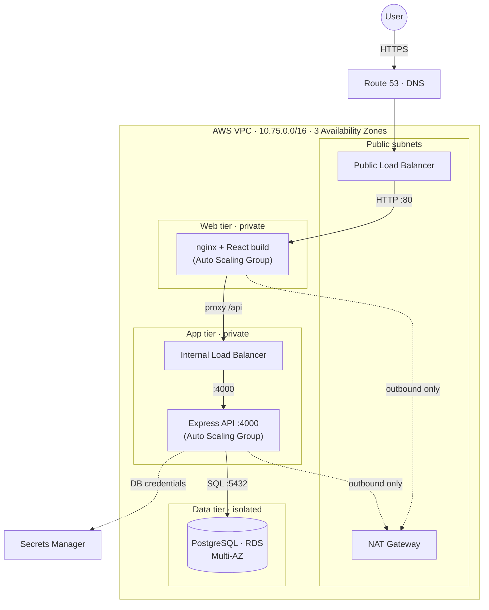

<div align="center">

# TeamOps

**A full-stack classroom project-management platform, deployed on a production-grade 3-tier AWS architecture — provisioned end to end with Terraform.**


</div>

---

TeamOps is a project-management application built for the classroom: a **faculty** member heads a
**class** and orchestrates many student **teams** — appointing team leaders, assigning tasks,
tracking progress, and commenting across every team. It is deployed the way real production systems
are: three isolated network tiers on AWS, secure by design, highly available, auto-scaling, and
defined entirely as code.

> The application is the workload. **The infrastructure is the deliverable.**

---

## Architecture



| Tier | Runs | Reachable from | Public IP |
| :--- | :--- | :--- | :--- |
| **Presentation** | nginx + React | the public load balancer only | No |
| **Application** | Express API | the internal load balancer only | No |
| **Data** | PostgreSQL (RDS) | the application tier only | No |

Each tier accepts traffic **only** from the tier directly in front of it. The browser reaches only
the public load balancer; the application tier and database have no public address and no route from
the internet.

---

## Highlights

**Platform**
- Faculty-orchestrated hierarchy — one class, many teams, layered role-based access control
- Classes, teams, tasks (Kanban + calendar), comments, and a class-wide overview
- Local JWT authentication; a clean REST API with Prisma over PostgreSQL

**Cloud architecture**
- Custom **VPC** with 12 subnets across 3 Availability Zones
- Tier-to-tier **security groups**, a **NAT gateway**, and an isolated database subnet
- **Public + internal load balancers**; **auto-scaling**, self-healing web and app tiers
- **Multi-AZ RDS**, **Secrets Manager** + scoped **IAM** roles, **Route 53** + **ACM** HTTPS
- **Packer** golden AMIs for fast instance boot
- 100% **Infrastructure as Code** — `terraform apply` builds it; `terraform destroy` removes it

---

## Tech stack

| Area | Stack |
| :--- | :--- |
| Frontend | React (Vite), Redux Toolkit, Tailwind CSS, nginx |
| Backend | Node.js, Express, Prisma, JWT |
| Database | PostgreSQL (AWS RDS) |
| Infrastructure | Terraform, Packer, AWS (VPC, EC2, ALB, RDS, IAM, Secrets Manager, Route 53, ACM) |
| Tooling | Docker Compose, Git, GitHub |

---

## Repository structure

```
TeamOps/
├── frontend/         React app — API-driven, built to static files, served by nginx
├── backend/          Express + Prisma REST API
├── infrastructure/   Terraform — the 3-tier AWS stack (7 modules)
├── packer/           Golden-AMI templates for the web and app tiers
├── docs/             Architecture, concept guides, report, and build logs
└── docker-compose.yml   Local stack: nginx + backend + PostgreSQL
```

---

## Getting started (local)

Requirements: Docker and Node.js 22.

```bash
# Start the full stack (PostgreSQL + backend + frontend)
docker compose up

# Seed sample data (first run, in another terminal)
cd backend && npm run seed
```

The app is served at `http://localhost:8080`. For frontend hot-reload during development:

```bash
cd frontend && npm run dev
```

---

## Deploying to AWS

```bash
# 1. Build the golden AMIs (once)
cd packer/web && packer init . && packer build .
cd ../app     && packer init . && packer build .

# 2. Provision the infrastructure
cd infrastructure
terraform init
terraform plan  -var-file=dev.tfvars
terraform apply -var-file=dev.tfvars
terraform output site_url          # the live HTTPS URL

# Tear everything down when finished
terraform destroy -var-file=dev.tfvars
```

Prerequisites (one-time): an S3 bucket for Terraform state, an EC2 key pair, and a Route 53 hosted
zone. See [`infrastructure/README.md`](infrastructure/README.md) for the full setup.

---

## How a request flows

A user clicks **Create Task**:

1. **Route 53** resolves the domain to the **public load balancer**.
2. The request arrives over **HTTPS**; TLS terminates at the load balancer (ACM certificate).
3. It is forwarded to a healthy **nginx** instance (web tier).
4. nginx matches `/api/*` and reverse-proxies to the **internal load balancer**.
5. That forwards to a healthy **Express** instance (app tier).
6. Express — having fetched the database password from **Secrets Manager** at boot via its **IAM
   role** — runs a Prisma query against **RDS**.
7. The response returns up the same chain.

The browser never learns that the application tier or database exist.

---

## Documentation

| Document | Purpose |
| :--- | :--- |
| [End-to-End Documentation](docs/END-TO-END.md) | The whole project in one place |
| [Project Report](docs/project-report.md) | Report / presentation content |
| [3-Tier Architecture Explained](docs/3-tier-explained.md) | The architecture in plain words |
| [DevOps Concepts Guide](docs/devops-guide.md) | Every component, concept by concept |
| [Infrastructure Deep Dive](docs/infra-deep-dive.md) | Every AWS service from first principles |
| [Architecture & PRD](docs/02-architecture.md) | Network, security, and design |

---

<div align="center">
<sub>Built for Introduction to Cloud Computing · Semester 5</sub>
</div>
