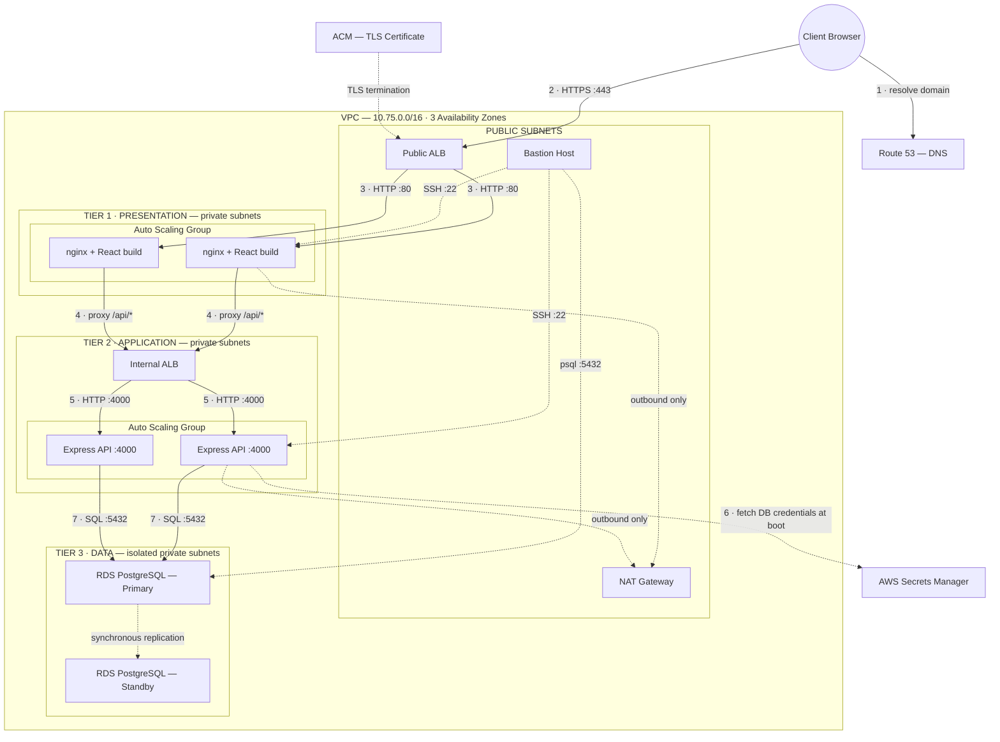

# TeamOps — Project Requirements Document

**Deploying a Full-Stack Project-Management Application on a 3-Tier AWS Architecture, Provisioned Entirely as Infrastructure-as-Code**

| | |
|---|---|
| **Course** | Introduction to Cloud Computing — Semester 5 |
| **Type** | Solo project |
| **Evaluation** | Mid-evaluation |
| **Primary artefact** | **The infrastructure.** The application is the workload it carries. |
| **Status** | Proposal / design. Not yet built. |

---

## 1. Executive Summary

**TeamOps** deploys *Team Flow* — a working full-stack project-management application (workspaces →
projects → tasks → comments) — onto Amazon Web Services using a **classic 3-tier architecture**:
a presentation tier, an application tier, and a data tier, each isolated in its own network
segment, communicating only through load balancers.

The entire environment is defined as code. A single `terraform apply` provisions the network,
servers, load balancers, database, secrets, and DNS from nothing. A single `terraform destroy`
removes it. No resource is ever created by hand.

The intent is not to ship a product. It is to **demonstrate command of cloud infrastructure**:
network isolation, defence in depth, high availability, automated scaling, secret management,
and immutable infrastructure — and to be able to defend every design decision.

---

## 2. Problem Statement

A typical student deployment puts the web server, the API, and the database on a single public
EC2 instance. It works, and it is wrong in every way that matters:

- The database is reachable from the internet.
- Credentials sit in a `.env` file on a public box.
- One instance failure takes the entire system down.
- A traffic spike takes the entire system down.
- Rebuilding it means remembering forty console clicks.

**TeamOps addresses each of these directly**, and the architecture below is the answer to each.

---

## 3. Objectives

| # | Objective | How it is demonstrated |
|---|---|---|
| **O1** | **Network isolation** — a genuine 3-tier topology | Each tier in its own subnets; database has *no route to the internet* |
| **O2** | **Infrastructure as Code** — nothing built by hand | `terraform apply` from an empty account produces a working system |
| **O3** | **Defence in depth** | Security groups chained tier-to-tier; each tier accepts traffic only from the tier above |
| **O4** | **Secret management** | No password in source control; credentials fetched from AWS Secrets Manager at boot via an IAM role |
| **O5** | **High availability** | Multi-AZ deployment; Multi-AZ RDS; instance failure is survived automatically |
| **O6** | **Elasticity** | Auto Scaling Groups add and remove capacity based on load |
| **O7** | **Immutable infrastructure** | Pre-baked machine images (Packer) instead of configuring servers at boot |

---

## 4. Architecture

### 4.1 Overview



### 4.2 Request path — what happens on "Create Project"

1. The browser resolves the domain through **Route 53** to the public load balancer.
2. `POST /api/projects` arrives at the **public ALB** on port 443. **TLS terminates here**
   (certificate from ACM). All traffic beyond this point is plain HTTP *inside* the VPC.
3. The ALB forwards to a healthy **nginx** instance in the web-tier private subnets.
4. nginx matches `location /api/` and reverse-proxies the request to the **internal ALB**.
5. The internal ALB forwards to a healthy **Express** instance on port 4000.
6. Express — which fetched its database password from **Secrets Manager** at boot — executes a
   Prisma query against **RDS PostgreSQL** on port 5432.
7. The row is written; the response returns up the same chain.

**At no point does the browser know that the application tier or the database exist.**
Neither has a public IP address, and neither has a route from the internet.

### 4.3 Network topology

VPC `10.75.0.0/16`, divided into **12 subnets across 3 Availability Zones**.

| Subnet group | CIDRs | Internet-routable? | Contents |
|---|---|---|---|
| **Public** | `10.75.1.0/24` · `.2.0/24` · `.3.0/24` | Yes (via IGW) | Public ALB, bastion host, NAT Gateway |
| **Web — private** | `10.75.4.0/24` · `.5.0/24` · `.6.0/24` | Outbound only (via NAT) | nginx + React build |
| **App — private** | `10.75.7.0/24` · `.8.0/24` · `.9.0/24` | Outbound only (via NAT) | Internal ALB, Express API |
| **DB — private** | `10.75.10.0/24` · `.11.0/24` · `.12.0/24` | **No route at all** | RDS PostgreSQL |

**Routing design**

- Public subnets → route table with `0.0.0.0/0 → Internet Gateway`
- Web and App private subnets → route table with `0.0.0.0/0 → NAT Gateway` *(egress only —
  outbound package installs and API calls work; inbound connections are impossible)*
- **DB subnets → no `0.0.0.0/0` route whatsoever.** The database cannot reach the internet and
  the internet cannot reach it, at the routing layer — independent of any firewall rule.

> A subnet is "public" *solely* because its route table sends `0.0.0.0/0` to an Internet Gateway.
> AWS has no "public subnet" flag. This is the entire distinction.

### 4.4 Security model

Traffic is permitted strictly in one direction, tier by tier:

```
Internet → [alb_sg] → [web_sg] → [app_alb_sg] → [app_sg] → [db_sg]
```

| Security group | Inbound rule | Source |
|---|---|---|
| `bastion_sg` | TCP 22 | **Administrator's IP only** |
| `alb_sg` — public ALB | TCP 80, 443 | `0.0.0.0/0` |
| `web_sg` — nginx | TCP 80 | `alb_sg` |
| | TCP 22 | `bastion_sg` |
| `app_alb_sg` — internal ALB | TCP 80 | `web_sg` |
| `app_sg` — Express | TCP 4000 | `app_alb_sg` |
| | TCP 22 | `bastion_sg` |
| `db_sg` — RDS | TCP 5432 | `app_sg` |
| | TCP 5432 | `bastion_sg` *(migrations, seeding)* |

**Every rule sources from another security group, never from an IP range.** This means the rules
remain correct as instances are created and destroyed by autoscaling — there are no IP addresses
to maintain. It is the defining property of a well-built AWS security model.

### 4.5 Secret management

Database credentials appear **nowhere** in source control, Terraform variables, or application code.

- Terraform provisions a secret in **AWS Secrets Manager** containing
  `{ username, password, endpoint, db_name }`.
- Application-tier instances carry an **IAM instance profile** granting
  `secretsmanager:GetSecretValue`, **scoped to that single secret's ARN** — not `*`.
- On boot, the Express application retrieves the secret, constructs its `DATABASE_URL`, and starts.

There is no long-lived AWS access key anywhere on any instance.

### 4.6 High availability and scaling

| Concern | Mechanism |
|---|---|
| Instance failure | ALB health checks stop routing to it; the Auto Scaling Group terminates and replaces it |
| Availability-Zone failure | Subnets, ASGs, and ALBs span 3 AZs |
| Database failure | **Multi-AZ RDS** — synchronous standby replica, automatic failover |
| Traffic spike | Target-tracking scaling policy on CPU adds instances automatically |
| Slow scale-out | **Packer-baked AMIs** — boot-to-healthy drops from ~5 minutes to ~60 seconds |

---

## 5. Technology Stack

| Layer | Technology | Rationale |
|---|---|---|
| **Presentation** | React (Vite), served as a static build by **nginx** | Static assets; nginx also acts as the reverse proxy to the app tier |
| **Application** | **Node.js + Express**, managed by PM2 | Existing Team Flow backend |
| **ORM** | **Prisma** | Team Flow's data model is already defined as a Prisma schema |
| **Data** | **AWS RDS — PostgreSQL 16**, Multi-AZ | Managed backups, patching, and failover; Prisma schema targets PostgreSQL |
| **Provisioning** | **Terraform** | Declarative, stateful, modular; industry standard |
| **Machine images** | **Packer** | Immutable infrastructure; fast, repeatable instance launches |
| **Local development** | **Docker Compose** | Runs Postgres + API + frontend locally, so application bugs are found before deployment |

---

## 6. AWS Services and Why Each Is Used

| Service | Purpose | Why not something simpler |
|---|---|---|
| **VPC** | Custom network, subnets, route tables | The default VPC has no private subnets — network isolation is impossible without a custom one |
| **Internet Gateway** | Inbound/outbound internet for public subnets | — |
| **NAT Gateway** | Outbound-only internet for private subnets | Private instances must fetch packages and OS updates *without* being reachable from outside |
| **EC2 + Launch Templates** | Compute for the web and app tiers | Requirement is an EC2-based 3-tier architecture |
| **Auto Scaling Groups** | Self-healing and elasticity | Without one, an instance failure is an outage |
| **Application Load Balancer** (×2) | Public ALB → web tier; **internal ALB** → app tier | The internal ALB is what allows the app tier to remain unroutable from the internet while still being reachable by the web tier |
| **RDS PostgreSQL (Multi-AZ)** | Managed relational database | Automatic failover, backups, and patching |
| **Secrets Manager** | Database credentials | Removes secrets from source control entirely |
| **IAM roles + instance profiles** | Authorises instances to read that one secret | No static AWS keys on any server |
| **Route 53** | DNS | Alias records resolve directly to the ALB |
| **ACM** | TLS certificate | Free, auto-renewing; TLS terminates at the ALB |
| **S3** | Terraform remote state + locking | Local state is unshareable and easily corrupted |
| **Bastion host** | The single SSH entry point to private instances | Private instances have no public IP by design |
| **CloudWatch** | Metrics driving the scaling policies | — |

---

## 7. The Application — Team Flow

A project-management tool: **Workspaces → Projects → Tasks → Comments**, with team membership
and role-based permissions.

### 7.1 Data model (Prisma / PostgreSQL)

```
User ──┬── WorkspaceMember ──── Workspace
       │                            │
       ├── ProjectMember ────── Project ──── Task ──── Comment
       │                            │          │
       └────────── owns ────────────┘          └── assigned to User
```

| Entity | Key fields |
|---|---|
| `User` | id, name, email, image |
| `Workspace` | id, name, slug, ownerId |
| `WorkspaceMember` | userId, workspaceId, role *(ADMIN / MEMBER)* |
| `Project` | id, name, workspaceId, team_lead, status, priority, dates, progress |
| `ProjectMember` | userId, projectId |
| `Task` | id, projectId, title, status *(TODO / IN_PROGRESS / DONE)*, type, priority, assigneeId, due_date |
| `Comment` | id, taskId, userId, content |

### 7.2 Application scope

The application is deliberately held to what **proves the infrastructure works end to end**:

| # | Capability | What it proves |
|---|---|---|
| F1 | List workspaces, projects, tasks | The full read path, browser → RDS |
| F2 | Create a project | The write path |
| F3 | Create a task | Writes across a related table |
| F4 | Move a task TODO → IN_PROGRESS → DONE | Updates; also demonstrates well |
| F5 | Comment on a task | A second-level relation |
| F6 | **Data survives a browser refresh** | It is a real database, not client-side state |

---

## 8. Scope Boundaries

**In scope:** the full 3-tier network, IaC provisioning, autoscaling, Multi-AZ RDS, secret
management, IAM least-privilege, load balancing, golden AMIs, HTTPS, remote state.

**Explicitly out of scope** — declared up front so effort stays on the graded work:

| Excluded | Reason |
|---|---|
| User authentication / login | Not a cloud-infrastructure concern; would not change one line of Terraform |
| Rewriting the React frontend | It already exists; it is ported, not rebuilt |
| CI/CD pipeline | A separate discipline; deployment is from a workstation |
| Containers (ECS / EKS / Kubernetes) | The requirement is an **EC2-based** 3-tier architecture. Docker is used only for local development |
| WAF, GuardDuty, VPC flow logs | Correct network isolation is in scope; compliance tooling is not |
| Cost optimisation | Environments are destroyed between sessions |

---

## 9. Delivery Phases

| Phase | Deliverable | Key learning |
|---|---|---|
| **0 · Foundation** | Repo, AWS account, IAM user + MFA, tooling, billing alarms | IAM, AWS CLI |
| **1 · Local baseline** | Team Flow running locally against Dockerised Postgres | Docker, Prisma — *establishes a known-good application before any cloud debugging* |
| **2 · Manual AWS** | The full network built **by hand** in the console, then destroyed | VPC, subnets, IGW, NAT, route tables, security groups, bastion, RDS |
| **3 · Terraform foundations** | The same VPC, rebuilt as code | HCL, state, variables, modules, data sources |
| **4 · Single-instance deploy** | App live on AWS via `terraform apply`; state moved to S3 | `user_data`, remote state, module composition |
| **5 · 3-tier split** ⭐ | Web + app tiers separated; public and internal ALBs; nginx reverse proxy | Load balancing, target groups, health checks |
| **6 · Secrets & IAM** | Secrets Manager + instance profile; zero credentials in code | IAM roles, least privilege |
| **7 · Resilience** 🎯 | Auto Scaling Groups, scaling policies, Multi-AZ RDS | Self-healing infrastructure — **the architecture is complete here** |
| **8 · Golden AMIs** | Packer-baked images | Immutable infrastructure |
| **9 · DNS & TLS** | Route 53 + ACM + HTTPS | DNS, certificate management, TLS termination |
| **10 · Documentation** | Diagram, runbook, cost report, demo | — |

**Phase 2 is treated as non-negotiable.** Building the network by hand before automating it is
what makes the Terraform comprehensible rather than incantation.

---

## 10. Cost

Funded by **$300 of AWS credit**.

| Resource | Approx. cost if left running |
|---|---|
| NAT Gateway | ~$32 / month |
| Application Load Balancers (×2) | ~$32 / month |
| RDS `db.t3.small`, Multi-AZ | ~$50 / month |
| EC2 instances (3–5 × `t3.small`) | ~$45 / month |
| **Total** | **~$160 / month** |

NAT Gateways and ALBs bill **hourly, whether or not traffic flows**. The environment is therefore
`terraform destroy`-ed at the end of every working session — a full session costs **$1–2**.
Treating infrastructure as disposable is both the cost strategy and the correct engineering
practice; it is precisely what Terraform exists to enable.

---

## 11. Deliverables

1. A public Git repository: `frontend/`, `backend/`, `infrastructure/`, `packer/`, `docs/`
2. Terraform capable of building the entire environment from an empty AWS account
3. Packer templates for the web- and app-tier AMIs
4. Architecture documentation and diagram
5. A runbook (deploy / destroy / troubleshoot) and a cost report
6. A demonstration: `terraform apply` → live application → **terminate an instance → the system
   self-heals** → `terraform destroy`

---

## 12. Risks

| Risk | Mitigation |
|---|---|
| Debugging a broken app across three private tiers | Phase 1 establishes a **known-good application locally first**, so any later failure is definitively infrastructural |
| Writing Terraform without understanding AWS | Phase 2 builds everything by hand first |
| Frontend hardcodes an API URL (`localhost:4000`), breaking behind the load balancer | Frontend must call **relative paths** (`/api/*`); identified and fixed in Phase 1 |
| Cost overrun from forgetting to destroy | Billing alarms at $50 / $100 / $200; `destroy` is part of the definition of "session finished" |
| Scope creep into application features | Section 8 declares non-goals explicitly |

---

## 13. Learning Outcomes

On completion, the following can be explained and defended without notes:

- Why a subnet is public — and that it is *purely* a routing-table property
- Why the database has no route to the internet in **either** direction
- Why an internal load balancer exists, rather than the web tier calling app servers directly
- Why security groups reference other security groups instead of IP ranges
- What happens, step by step, when an EC2 instance dies
- Why credentials belong in Secrets Manager rather than environment variables
- What Terraform state contains, and why it belongs in S3 with locking
- Why a NAT Gateway costs $32/month, and what the alternatives trade away
