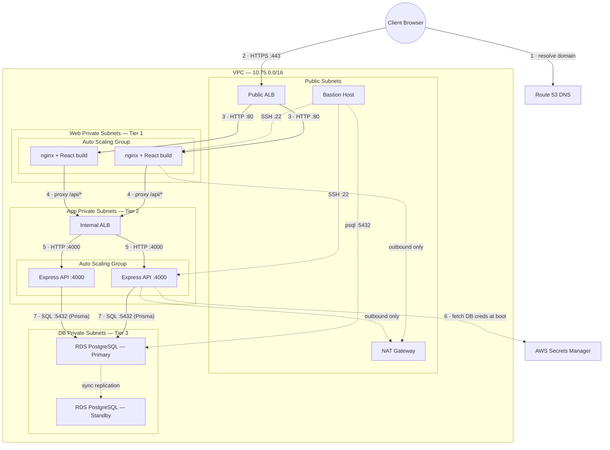

# TeamOps — Architecture

**Status:** design intent, written before the build. Parts of this *will* be wrong — that's
expected. Revise at the end of the 3-tier phase (Phase 5), when it's real.

---

## 1. The idea in one paragraph

Three tiers, each in its own subnets, each only reachable from the tier directly above it.
The browser can only talk to the public load balancer. The load balancer can only talk to the
web tier. The web tier can only talk to the internal load balancer. The app tier is the only
thing on earth that can open a connection to the database. Nothing in the two private tiers has
a public IP; they reach the internet for outbound traffic only, through a NAT Gateway.

Every rule above is enforced by **security groups that reference other security groups**, not by
IP ranges. That's the single most important design decision in the project.

---

## 2. Diagram



---

## 3. Network topology

VPC CIDR `10.75.0.0/16`, split into 12 subnets across 3 Availability Zones.

| Group | CIDRs | Public? | Contains |
|---|---|---|---|
| **Public** | `10.75.1.0/24`, `.2.0/24`, `.3.0/24` | Yes | Public ALB, bastion, NAT Gateway |
| **Web private** | `10.75.4.0/24`, `.5.0/24`, `.6.0/24` | No | nginx + React build (ASG) |
| **App private** | `10.75.7.0/24`, `.8.0/24`, `.9.0/24` | No | Internal ALB, Express API (ASG) |
| **DB private** | `10.75.10.0/24`, `.11.0/24`, `.12.0/24` | No | RDS PostgreSQL |

**Routing**

- Public subnets → route table with `0.0.0.0/0 → Internet Gateway`
- Web + App private subnets → route table with `0.0.0.0/0 → NAT Gateway` (outbound only)
- DB private subnets → **no `0.0.0.0/0` route at all.** The database has no path to the internet
  in either direction. This is deliberate and it's a viva answer.

> **The thing to actually understand:** a subnet is "public" *only* because its route table sends
> `0.0.0.0/0` to an Internet Gateway. There is no "public" checkbox in AWS. That is the entire
> difference between a public and a private subnet.

---

## 4. Security groups

The whole security model. Note that every rule sources from **another security group**, never
from a CIDR — so it keeps working no matter how instances scale or change IP.

```
Internet → [alb_sg] → [web_sg] → [app_alb_sg] → [app_sg] → [db_sg]
```

| Security group | Inbound | From |
|---|---|---|
| `bastion_sg` | TCP 22 | My IP only *(not `0.0.0.0/0` — the reference repo does this and it's wrong)* |
| `alb_sg` (public ALB) | TCP 80, 443 | `0.0.0.0/0` |
| `web_sg` (nginx) | TCP 80 | `alb_sg` |
| | TCP 22 | `bastion_sg` |
| `app_alb_sg` (internal ALB) | TCP 80 | `web_sg` |
| `app_sg` (Express) | TCP 4000 | `app_alb_sg` |
| | TCP 22 | `bastion_sg` |
| `db_sg` (RDS) | TCP 5432 | `app_sg` |
| | TCP 5432 | `bastion_sg` *(for migrations and seeding)* |

Egress is `0.0.0.0/0` everywhere. That's normal — the private subnets' *route tables* are what
actually prevent inbound access, not egress rules.

---

## 5. The request path

What happens when a user clicks "Create Project":

1. Browser resolves `teamops.<domain>` via Route 53 → the public ALB.
2. `POST https://teamops.<domain>/api/projects` hits the ALB on 443. **TLS terminates here**
   (ACM certificate). Everything past this point is plain HTTP inside the VPC.
3. ALB forwards to a healthy nginx instance in the web private subnets, on port 80.
4. nginx matches `location /api/` and reverse-proxies to the **internal** ALB's DNS name.
5. Internal ALB forwards to a healthy Express instance on port 4000.
6. Express (which fetched the DB password from Secrets Manager at boot) runs a Prisma query
   over port 5432 to the RDS primary.
7. The row is written. The response travels back up the same chain.

At no point does the browser know that the app tier or the database exist. They have no public
IPs and no route from the internet.

---

## 6. Secrets and IAM

RDS credentials are **never** in Terraform source, `.tfvars`, or the app's code.

- Terraform creates the secret in Secrets Manager holding `{username, password, endpoint, db_name}`.
- The app tier's EC2 instances carry an **IAM instance profile** whose role grants
  `secretsmanager:GetSecretValue` — scoped to *this one secret's ARN*, not `*`.
- On boot, the Express app calls Secrets Manager, builds its `DATABASE_URL`, and starts.

> The reference repo scopes its IAM policy to `Resource = "*"`. Don't copy that. Scoping it to
> a single ARN is a two-line change and it's a guaranteed viva question.

---

## 7. Where this deliberately differs from the reference repo

Decisions made *against* `3-tier/`, with reasons. These are worth knowing cold — an examiner
who has seen the original repo will notice.

| # | Reference repo does | We do | Why |
|---|---|---|---|
| 1 | MySQL 8.0, port 3306 | **PostgreSQL 16, port 5432** | Team Flow's `schema.prisma` is Postgres. Fighting it is pointless. |
| 2 | Internal ALB placed in the **public** subnets | Internal ALB in the **app private** subnets | An internal ALB in public subnets works, but it contradicts the architecture we're claiming. Put it where the diagram says it is. |
| 3 | Instances `git clone` the app from GitHub at boot | Same, **but from our own repo** | The reference clones the *original author's* repo — meaning local code edits deploy nothing. This is the single biggest trap in that codebase. |
| 4 | `bastion_sg` allows SSH from `0.0.0.0/0` | SSH from **my IP only** | Free marks. Also just correct. |
| 5 | IAM secrets policy: `Resource = "*"` | Scoped to the single secret ARN | Least privilege. Guaranteed viva question. |
| 6 | nginx `proxy_pass http://alb:80/;` — trailing slash **strips** the `/api` prefix | Decide once, document it, make both ends agree | The reference's Express routes are unprefixed (`/transaction`), which is why its trailing slash works. Our API uses `/api/*` routes, so we **drop the trailing slash**. Getting this wrong costs half a day of mystery 404s. |
| 7 | One NAT Gateway for all AZs | Same (one NAT) | A NAT per AZ is the "correct" HA answer but triples the cost for zero marks. Know the tradeoff; state it in the viva. |

---

## 8. Known weaknesses (say these before the examiner does)

Being able to critique your own design scores better than pretending it's perfect.

- **Single NAT Gateway** = a single point of failure for private-subnet egress. Production would
  run one per AZ. Rejected on cost.
- **No CI/CD.** Deploys run from a laptop. A GitHub Actions pipeline would be the next step.
- **No WAF, no VPC flow logs, no GuardDuty.** Out of scope.
- **No real authentication.** The frontend hardcodes `user_1`. The infrastructure is the graded
  artefact; auth would not change a single Terraform file.
- **The app tier reaches the internet via NAT** to `npm install` at boot. Packer AMIs (Phase 8)
  reduce but don't eliminate this.
