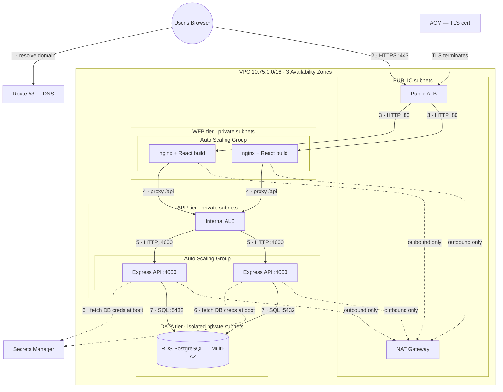

# TeamOps — End-to-End Documentation

Everything about the project in one place: what it is, how the application works, how the 3-tier AWS
architecture is built, how a request flows through it, and how to run and deploy it.

---

## 1. Overview

**TeamOps** is a full-stack project-management application deployed on a **3-tier AWS architecture**,
provisioned entirely with **Terraform**. It runs as a **faculty-orchestrated classroom platform**:

- A **faculty** member heads a **class** and oversees many student **teams**.
- Faculty create teams, appoint a **team leader** for each, add students, assign **tasks**, track
  progress, and **comment** — across every team in the class.
- Team leaders manage their own team; students work on their assigned tasks.

The application is the *workload*. The **infrastructure is the graded deliverable** — the point of
the project is deploying a real app the way production systems are actually built: isolated,
secure, highly available, auto-scaling, and defined as code.

### Domain model (classroom ⇄ system)

| Classroom | System entity |
|-----------|---------------|
| Class | Workspace |
| Faculty (class head) | Workspace ADMIN |
| Team | Project |
| Team leader | Project team-lead |
| Student | Project member |
| Assigned work | Task |
| Discussion | Comment |

---

## 2. Technology stack

| Layer | Technology |
|-------|-----------|
| Presentation | React (Vite), served by **nginx** |
| Application | **Node.js + Express**, Prisma ORM, JWT auth |
| Data | **PostgreSQL** (AWS RDS) |
| Infrastructure as Code | **Terraform** (7 modules) |
| Golden images | **Packer** |
| Cloud | **AWS** |
| Local dev | **Docker Compose** |
| Source control | Git + GitHub |

Deliberate adaptations from the original reference app (to make it a self-contained cloud
deployment): **Clerk → local JWT auth**, **Neon → standard PostgreSQL/RDS**, **Inngest → a direct
mailer**, **Vercel → EC2 + nginx**.

---

## 3. Repository structure

```
TeamOps/
├── frontend/         React app (Vite) — API-driven, built to static files, served by nginx
├── backend/          Express + Prisma REST API
├── infrastructure/   Terraform — the 3-tier AWS stack (7 modules)
├── packer/           Golden-AMI templates for the web and app tiers
├── docs/             Architecture, concept guides, report, and PR-by-PR build plans
├── docker-compose.yml  Local stack: nginx + backend + PostgreSQL
├── PLAN.md           The phased build plan
└── README.md
```

---

## 4. The application

### 4.1 Backend (Application tier)

An Express REST API using Prisma over PostgreSQL. Seven models: **User, Workspace, WorkspaceMember,
Project, ProjectMember, Task, Comment.**

**Auth** — local: register/login issue a JWT; a `protect` middleware verifies the token on every
protected route and exposes the current user. No external auth provider.

**Role-based access control (RBAC)** — layered:
- A **workspace ADMIN (faculty)** can manage every team in the class — create/update/delete tasks,
  comment, and add members anywhere.
- A **team lead** can manage their own team.
- A **student** can work within teams they belong to.

The single rule `canManageProject(project, user)` = *team lead OR workspace admin* is what grants
faculty their cross-team authority.

**API surface**

```
POST   /api/auth/register        POST /api/auth/login        GET  /api/auth/me
GET    /api/workspaces           POST /api/workspaces        POST /api/workspaces/add-member
POST   /api/projects             PUT  /api/projects          POST /api/projects/:id/addMember
POST   /api/tasks                PUT  /api/tasks/:id         POST /api/tasks/delete
POST   /api/comments             GET  /api/comments/:taskId
GET    /health
```

**Cloud-ready seams built in:**
- Database credentials read from **one config module** → becomes AWS Secrets Manager on the cloud.
- A **`/health`** endpoint → the load-balancer health-check target.
- **`prisma migrate deploy` on boot** → a fresh database self-initializes.

### 4.2 Frontend (Presentation tier)

A React (Vite) single-page app. Redux Toolkit holds the loaded class tree; one call to
`GET /api/workspaces` hydrates the whole UI.

**Key screens:** Login/Sign-up, Dashboard (stats + charts), **Class Overview** (all teams at a
glance for faculty), Teams list, Team detail (task board / overview / calendar), Task detail
(status flow, comments, delete), People (class members).

**The critical cloud design choice:** the frontend calls **relative `/api` URLs** — never a
hardcoded backend address — so nginx can proxy them and the same build works behind a load balancer.

### 4.3 Local development

```bash
docker compose up            # PostgreSQL + backend + frontend (nginx)
cd backend && npm run seed   # sample data (first run)
```

`docker-compose.yml` runs all three tiers as containers — a local mirror of the cloud architecture
(nginx → backend → PostgreSQL), the backend reaching the database by service name just as it will
reach RDS.

---

## 5. The 3-tier AWS architecture

### 5.1 Diagram



### 5.2 The three tiers

| Tier | Runs | Subnets | Reachable from |
|------|------|---------|----------------|
| **Presentation** | nginx + React build | web private | the public ALB only |
| **Application** | Express API | app private | the internal ALB only |
| **Data** | PostgreSQL (RDS) | db private (isolated) | the app tier only |

**The governing rule:** each tier accepts traffic only from the tier directly in front of it. The
browser only ever reaches the public load balancer; the app tier and database have no public address
and no route from the internet.

### 5.3 Network

- **VPC** `10.75.0.0/16` — a private network holding everything.
- **12 subnets** (public / web / app / db × 3 AZs) — tier separation + survival of a data-center
  failure.
- **Internet Gateway** — the public subnets' door to the internet.
- **NAT Gateway** — outbound-only internet for the web/app tiers (package installs, updates); the db
  subnets have **no internet route at all**.
- **The public/private distinction is purely the route table:** public subnets route `0.0.0.0/0` to
  the IGW; private tiers route it to the NAT; the database routes it nowhere.

### 5.4 Security (defense in depth)

Security groups chain tier-to-tier, each referencing the *previous group* (not IP ranges), so rules
survive auto-scaling:

```
Internet → [public ALB] → [web] → [internal ALB] → [app] → [database]
```

Plus: RDS is encrypted and not publicly accessible; the DB password lives in **Secrets Manager**
(never in code); the app tier reads it via an **IAM role scoped to that one secret** (no stored AWS
keys); TLS terminates at the public ALB (encryption in transit); admin SSH is only via a bastion.

### 5.5 High availability & scaling

- Subnets, load balancers, and server fleets span **3 Availability Zones**.
- **RDS Multi-AZ** — a synchronous standby fails over automatically.
- **Auto Scaling Groups** — replace any failed instance automatically (self-healing).
- **Target-tracking scaling policies** — add/remove servers to hold ~50% CPU.
- **Packer golden AMIs** — instances boot ready-to-serve (~60s) instead of installing software
  (~5 min).

### 5.6 Terraform modules

| Module | Provisions |
|--------|-----------|
| `vpc` | VPC, 12 subnets, IGW, NAT, route tables |
| `security` | the six tier-to-tier security groups |
| `rds` | PostgreSQL (Multi-AZ, private) + subnet group |
| `secrets` | DB credentials in Secrets Manager |
| `alb` | public + internal load balancers |
| `compute` | IAM role/profile, launch templates, ASGs, scaling policies |
| `dns` | Route 53 record + ACM certificate + HTTPS listener |

State is stored remotely in **S3** with locking.

---

## 6. How a request flows end to end

Following a **"Create Task"** click from faculty:

1. Browser resolves `teamops.<domain>` via **Route 53** → the **public ALB**.
2. `POST /api/tasks` arrives at the public ALB over **HTTPS**; TLS decrypts here (ACM cert).
3. The ALB forwards to a healthy **nginx** instance (web tier).
4. nginx matches `/api/` and reverse-proxies to the **internal ALB**.
5. The internal ALB forwards to a healthy **Express** instance (app tier) on port 4000.
6. Express — which fetched the DB password from **Secrets Manager** at boot via its **IAM role** —
   checks permission (`canManageProject`), then runs a **Prisma** query on port 5432 to **RDS**.
7. The task row is written; the response returns up the same chain to the browser.

The browser never knew the app tier or database existed — they have no public address.

---

## 7. Building & deploying

### 7.1 Golden AMIs (Packer) — build first

```bash
cd packer/web && packer init . && packer build .    # → teamops-web-*
cd ../app     && packer init . && packer build .     # → teamops-app-*
```

### 7.2 Infrastructure (Terraform)

```bash
cd infrastructure
# one-time: create an S3 state bucket, set it in backend.tf
# edit dev.tfvars: key pair, your IP, hosted zone; pass db_password securely
terraform init
terraform validate
terraform plan  -var-file=dev.tfvars
terraform apply -var-file=dev.tfvars     # builds the whole stack
terraform output site_url                # the HTTPS URL
terraform destroy -var-file=dev.tfvars   # tear down (stops the bill)
```

### 7.3 Cost note

The full stack left running is ~$160/month (NAT + 2 ALBs + Multi-AZ RDS + EC2, all hourly). The
strategy is **`terraform destroy` after every session** — a working session costs ~$1–2.

---

## 8. Project status

- **Backend** — complete: auth, RBAC, classes, teams, tasks, comments, faculty mode.
- **Frontend** — complete: dashboard, class overview, teams, tasks, comments, sign-up, create-class,
  team population.
- **Infrastructure** — the full 3-tier stack + Packer AMIs authored in Terraform.
- **Pending:** verification (`npm run build`, `terraform validate` — free, once tooling is
  reinstalled) and a live `terraform apply` to an AWS account, then the self-healing demo.

---

## 9. Further reading (in `docs/`)

- `project-report.md` — report/presentation content (intro → conclusion)
- `3-tier-explained.md` — the architecture in plain words
- `devops-guide.md` — every component, concept by concept
- `infra-deep-dive.md` — every AWS service from first principles
- `00-PRD.md`, `01-requirements.md`, `02-architecture.md` — the design
- `backend-implementation.md`, `frontend-implementation.md`, `infrastructure-implementation.md`,
  `faculty-mode-implementation.md` — PR-by-PR build logs
- `infrastructure-roadmap.md`, `phase2-aws-by-hand.md` — the deployment path
