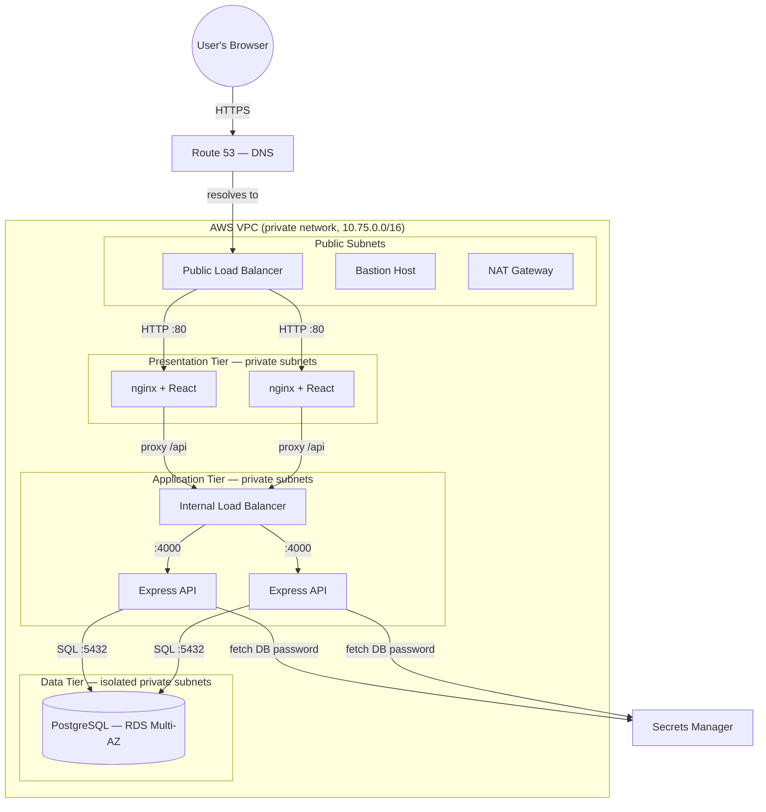

# TeamOps — Project Report & Presentation Content

Deploying a full-stack project-management application on a **3-Tier AWS Architecture**, provisioned
entirely as code with Terraform.

> This document is a content bank for your report and slides. It is intentionally over-written —
> take the sections, bullets, tables, and diagrams you need and leave the rest.

---

# 1. Introduction

## 1.1 What the project is (one line)
TeamOps is a full-stack **project-management web application** (workspaces → projects → tasks →
comments) deployed on Amazon Web Services using a classic **three-tier architecture**, where every
piece of cloud infrastructure is defined as code.

## 1.2 Elevator paragraph
Modern applications are rarely a single program on a single machine. They are split into layers —
the part users see, the part that processes logic, and the part that stores data — each running on
separate, independently secured and scaled infrastructure. TeamOps demonstrates this end to end: a
React front end, a Node.js/Express API, and a PostgreSQL database, deployed across isolated network
tiers on AWS, built and destroyed with a single command.

## 1.3 The technology stack

| Layer | Technology |
|-------|-----------|
| Front end (Presentation) | React (Vite), served by **nginx** |
| Back end (Application) | Node.js + **Express**, Prisma ORM |
| Database (Data) | **PostgreSQL** on AWS RDS |
| Infrastructure as Code | **Terraform** |
| Cloud provider | **Amazon Web Services (AWS)** |
| Local development | Docker + Docker Compose |
| Version control / CI surface | Git + GitHub (feature-branch + PR workflow) |

## 1.4 What the project demonstrates
- A genuine **3-tier separation** with network isolation between layers.
- **Infrastructure as Code** — the whole environment is reproducible and disposable.
- **Security by design** — the database is unreachable from the internet; no credentials in code.
- **High availability & auto-scaling** — the system survives server and data-center failures.
- **A complete software-engineering lifecycle** — from application code to cloud deployment.

## 1.5 Scale of the work (useful "by the numbers" slide)
- **62 backend + frontend pull requests**, each a small, reviewed unit of work.
- **25 infrastructure pull requests** building 7 reusable Terraform modules.
- **12 subnets across 3 Availability Zones**; two load balancers; auto-scaling web and app tiers.
- **13 documentation files** covering architecture, concepts, and build process.

---

# 2. Problem Statement — Why 3-Tier?

## 2.1 The naive approach and why it fails
The simplest way to deploy an app is to put **everything on one server** exposed to the internet —
the web page, the business logic, and the database, all on one public machine. It works in a demo
and fails everywhere that matters:

| Problem with a single public server | Consequence |
|-------------------------------------|-------------|
| The database is reachable from the internet | One breach exposes all user data |
| Credentials sit in a file on a public box | A leaked file is a total compromise |
| One machine handles everything | A traffic spike or a crash takes the *whole* system down |
| No redundancy | A single hardware or data-center failure = full outage |
| Manual setup | Not repeatable, not reviewable, impossible to recreate reliably |

## 2.2 The core problems a real deployment must solve
1. **Security / isolation** — sensitive data must be unreachable from the outside world, even if the
   public-facing layer is breached.
2. **Availability** — the system must survive the failure of a server, or an entire data center,
   without going down.
3. **Scalability** — it must handle variable load, adding capacity under pressure and removing it
   when idle.
4. **Secret management** — passwords and keys must never live in source code.
5. **Repeatability** — the environment must be rebuildable from scratch, identically, every time.

## 2.3 Why three tiers specifically
Splitting the system into **Presentation, Application, and Data** tiers — each on its own isolated
network segment — directly answers every problem above:

- **Security:** each tier only accepts traffic from the tier in front of it; the database accepts
  connections from nothing but the application tier and has no route to the internet at all.
- **Availability:** each tier is a fleet spread across multiple data centers; any one server or data
  center can fail without downtime.
- **Scalability:** you scale the tier under load independently — add web servers for browsing spikes,
  app servers for processing spikes — instead of over-provisioning one giant machine.
- **Clarity & maintainability:** each tier has one job, making the system easier to reason about,
  secure, and change.

## 2.4 One-sentence problem statement (for a slide)
> *How do we deploy a web application so that it is secure, highly available, scalable, and fully
> reproducible — rather than a single fragile server exposed to the internet?*

---

# 3. Objectives

The project set out to achieve the following, measurable goals:

**O1 — Build a genuine 3-tier architecture.** Presentation, application, and data tiers in separate
subnets, with traffic funneled strictly through load balancers.

**O2 — Provision everything as code.** A single `terraform apply` builds the entire stack from an
empty account; a single `terraform destroy` removes it. Nothing created by hand.

**O3 — Make the database unreachable from the internet.** Not merely password-protected — *unroutable*.
No public IP, no internet route, inbound access only from the application tier.

**O4 — Keep secrets out of source code.** The application fetches its database password from AWS
Secrets Manager at runtime, authorized by an IAM role — never a hardcoded credential.

**O5 — Survive failure automatically.** Auto Scaling Groups replace failed servers; a Multi-AZ
database survives the loss of a data center.

**O6 — Scale with demand.** Automatically add and remove servers based on load.

**O7 — Be fully documented and defensible.** Every design decision explainable, with documentation
from first principles.

---

# 4. Methodology

This is the heart of the report: what a 3-tier architecture is, every component in it, and how the
system was built end to end.

## 4.1 The 3-Tier Model — overview

A 3-tier architecture divides an application into three layers, each on its own machines:

| Tier | Name | Responsibility | In TeamOps |
|------|------|----------------|-----------|
| **Tier 1** | Presentation | Show the interface, take user input | React app served by nginx |
| **Tier 2** | Application | Business logic, rules, permissions | Express API |
| **Tier 3** | Data | Store and retrieve data | PostgreSQL (RDS) |

**The governing rule:** a user only ever talks to the presentation tier. The presentation tier is
the only thing that talks to the application tier. The application tier is the *only* thing that can
open a connection to the database. Each layer is a locked room reachable only from the room in front
of it.

### Architecture diagram

## 4.2 The application layers (the software)

### Presentation Tier — React + nginx
- A single-page application built with React and bundled by Vite into static files.
- Served by **nginx**, which also acts as a **reverse proxy**: requests for pages are served
  directly; requests beginning with `/api` are forwarded down to the application tier.
- Calls the API using **relative URLs** (`/api/...`) — it never knows the back end's address, which
  is what allows it to sit behind a load balancer unchanged.

### Application Tier — Express + Prisma
- A Node.js/Express REST API exposing endpoints for authentication, workspaces, projects, tasks, and
  comments.
- Uses **Prisma** as an ORM to talk to PostgreSQL in a type-safe way.
- Enforces **role-based permissions** (e.g. only a workspace admin can create projects; only a
  project's lead can add tasks).
- Fetches its database credentials from Secrets Manager at startup and exposes a lightweight
  `/health` endpoint for load-balancer checks.

### Data Tier — PostgreSQL on RDS
- A relational schema of seven tables: User, Workspace, WorkspaceMember, Project, ProjectMember,
  Task, Comment.
- Managed by AWS RDS: automated backups, patching, and a standby replica for failover.

> **Design note (good for a slide):** the reference application used external SaaS (Clerk for auth,
> Neon for the database). These were deliberately replaced with **self-contained local JWT auth** and
> **standard PostgreSQL**, so the entire system lives inside our own VPC with no external dependencies
> — which is what makes a true 3-tier cloud deployment possible.

## 4.3 The infrastructure components — every building block

This is the detailed walkthrough of *what each AWS component is and why it's there*.

### (a) VPC — Virtual Private Cloud
- **What:** a private, isolated network inside AWS with its own address range (`10.75.0.0/16`).
- **Why:** gives us a walled compound we fully control, rather than exposing servers on the open
  internet.

### (b) Subnets
- **What:** subdivisions of the VPC, each a smaller address range in one Availability Zone.
- **Our layout:** 12 subnets — 3 public, 3 web, 3 app, 3 database — spread across 3 AZs.
- **Why:** separates tiers and spreads them across data centers for availability.

### (c) Availability Zones
- **What:** physically separate data centers within one AWS region.
- **Why:** placing each tier in three AZs means one data-center failure doesn't take the system down.

### (d) Route Tables
- **What:** rules deciding where network traffic goes based on its destination.
- **The key idea:** a subnet is "public" *only* because its route table sends internet-bound traffic
  (`0.0.0.0/0`) to an Internet Gateway. There is no "public" switch — it is entirely about routing.

### (e) Internet Gateway (IGW)
- **What:** the VPC's single door to the public internet.
- **Why:** only the public subnets route to it — that's what makes the load balancer reachable.

### (f) NAT Gateway
- **What:** lets private servers reach the internet **outbound only** (to download updates and
  packages) while blocking all inbound connections.
- **Why:** private web/app servers must stay patched without being exposed. The database subnets don't
  use it at all — they have no internet access whatsoever.

### (g) Security Groups
- **What:** stateful firewalls attached to each resource, with an allow-list of permitted traffic.
- **The powerful feature:** rules reference *other security groups* rather than IP addresses, so they
  keep working as servers scale and change IPs.
- **The chain:** internet → public ALB → web tier → internal ALB → app tier → database. Each tier
  accepts traffic only from the one in front of it (least privilege).

### (h) RDS — Relational Database Service
- **What:** a managed PostgreSQL database (AWS handles backups, patching, failover).
- **Key settings:** Multi-AZ (automatic failover to a standby in another data center), encrypted
  storage, and `publicly_accessible = false` (no public endpoint).

### (i) Secrets Manager
- **What:** an encrypted vault storing the database credentials.
- **Why:** passwords never appear in code or config; the app fetches them at runtime.

### (j) IAM — Identity and Access Management
- **What:** the permission system. The app servers assume a **role** (via an **instance profile**)
  that grants permission to read *only the one database secret*.
- **Why (least privilege):** no AWS keys are stored on servers; if a server were compromised, the
  attacker could read that single secret and nothing else.

### (k) Application Load Balancers (ALB)
- **What:** distribute incoming requests across identical servers and remove unhealthy ones (via
  health checks).
- **Two of them:**
  - **Public ALB** — internet-facing, the site's front door (ports 80/443).
  - **Internal ALB** — no public address; only the web tier can reach it. This is what keeps the app
    tier private while still being load-balanced.

### (l) Launch Templates & User Data
- **What:** blueprints describing how to build a server (image, size, security group) plus a startup
  script ("user data") that installs and starts the application on first boot.
- **Why:** lets auto scaling create identical, ready-to-serve servers on demand.

### (m) Auto Scaling Groups (ASG)
- **What:** keep a target number of identical servers running across AZs and automatically replace any
  that fail.
- **Why:** self-healing (a killed server is rebuilt with no downtime) and the basis for scaling.

### (n) Scaling Policies & CloudWatch
- **What:** rules that add or remove servers to keep average CPU near a target (50%), driven by
  CloudWatch metrics.
- **Why:** automatic elasticity — grow under load, shrink when quiet, to balance performance and cost.

### (o) Route 53 (DNS)
- **What:** translates the domain name (`teamops.<domain>`) into the load balancer's address.
- **Why:** users type a real name, not an IP.

### (p) ACM & HTTPS
- **What:** a free, auto-renewing SSL/TLS certificate enabling HTTPS; encryption terminates at the
  public load balancer.
- **Why:** secure, encrypted connections and the browser padlock.

## 4.4 Infrastructure as Code — the Terraform approach
- The entire environment is described in **Terraform** configuration files, not clicked together by
  hand.
- Organized into **7 reusable modules**: `vpc`, `security`, `rds`, `secrets`, `alb`, `compute`, `dns`.
- **Terraform state** (its record of what exists) is stored remotely in an **S3 bucket** with locking,
  so it is durable and safe for teams.
- **Benefits:** repeatable (rebuild identically), reviewable (it's code in git), and disposable
  (`terraform destroy` removes everything — which is also the cost-control strategy).

## 4.5 How it was built — the engineering process
- Built incrementally as **small pull requests**, each adding one concept (one module, one resource
  group), fully reviewed before merging — mirroring professional practice.
- **Application first, locally:** the app was made to run end-to-end on a laptop (React + Express +
  PostgreSQL via Docker) to establish a known-good baseline before any cloud work.
- **Then the infrastructure:** the Terraform was written module by module — network first, then
  security, data, load balancing, compute, and finally DNS/HTTPS — each building on the last.
- **Design seams built for the cloud:** relative API URLs (for the load balancer), a `/health`
  endpoint (for health checks), a single database-credentials config point (for Secrets Manager), and
  migrations-on-boot (so a fresh database self-initializes) — all added in the app so the cloud
  migration would be seamless.

## 4.6 The request lifecycle — an end-to-end walkthrough
Following a single "Create Project" click through the whole system:

1. The browser resolves `teamops.<domain>` via **Route 53** to the **public load balancer**.
2. The request arrives at the public ALB over **HTTPS**; TLS is decrypted here (via the **ACM**
   certificate).
3. The ALB forwards it to a healthy **web server (nginx)** in a private subnet.
4. nginx sees the `/api/` prefix and **reverse-proxies** the request to the **internal load
   balancer**.
5. The internal ALB forwards it to a healthy **app server (Express)** on port 4000.
6. The app server — which fetched the DB password from **Secrets Manager** at boot via its **IAM**
   role — runs a query over port 5432 to the **RDS** database.
7. The row is written; the response travels back up the same chain to the browser.

At no point does the browser know the application tier or database exist — they have no public
address and no route from the internet.

## 4.7 The security model (defense in depth) — good standalone slide
- **Network isolation:** database in subnets with no internet route at all.
- **Firewall chaining:** each tier's security group admits traffic only from the tier in front of it.
- **No stored credentials:** database password in Secrets Manager, retrieved via a scoped IAM role.
- **Single entry point for admins:** a bastion host is the only SSH route into private servers.
- **Encryption in transit:** HTTPS from the user to the load balancer.
- **Encryption at rest:** encrypted database storage.

## 4.8 High availability & scaling — good standalone slide
- **Multi-AZ everything:** subnets, load balancers, and server fleets span three data centers.
- **Multi-AZ database:** a synchronous standby takes over automatically if the primary's data center
  fails.
- **Self-healing:** Auto Scaling Groups replace any failed server with no downtime.
- **Elastic scaling:** CPU-based policies add and remove servers with demand.
- **The demonstration:** terminating a running server on purpose — the system routes around it and
  rebuilds a replacement while staying online.

---

# 5. Conclusion

## 5.1 What was achieved
TeamOps successfully demonstrates a complete, production-style **3-tier architecture on AWS**:
- A full-stack application cleanly separated into presentation, application, and data tiers.
- The entire cloud environment defined as **Infrastructure as Code** with Terraform, reproducible and
  disposable via a single command.
- A **secure-by-design** deployment: the database is unreachable from the internet, and no credential
  is ever stored in code.
- **High availability and auto-scaling** that survive server and data-center failures and adapt to
  load.

## 5.2 Key takeaways / learnings
- A subnet's public/private nature is defined **entirely by its route table**, not a setting — the
  single most clarifying idea in cloud networking.
- **Security groups referencing other security groups** (not IPs) is what makes least-privilege
  firewalling survive auto-scaling.
- **Infrastructure as Code** turns a fragile, un-repeatable manual setup into a reviewable, rebuildable
  asset — and makes "destroy it to save money" a safe, everyday action.
- Designing the *application* with the deployment in mind (relative URLs, health checks, a secrets
  seam) is what makes the cloud migration smooth rather than painful.

## 5.3 Challenges addressed
- **Adapting a serverless-oriented app** (external auth and database) into a self-contained VPC
  deployment by replacing those dependencies with local auth and standard PostgreSQL.
- **Keeping the app tier private** while still load-balanced — solved with an internal load balancer.
- **Eliminating stored secrets** — solved with Secrets Manager plus a scoped IAM role.

## 5.4 Future enhancements
- **Golden images with Packer** — pre-baking server images so new instances boot in seconds instead
  of installing software each time.
- **CI/CD pipeline** — automatically deploying on every code change.
- **Observability** — centralized logging, dashboards, and alerting (CloudWatch/Grafana).
- **One NAT gateway per AZ** — removing the single-NAT point of failure for full production HA.
- **Containers / orchestration** — an evolution toward ECS or Kubernetes.

## 5.5 Closing statement (for a final slide)
> TeamOps turns a simple project-management app into a secure, resilient, self-scaling cloud system —
> and, by defining every layer as code, makes that entire system something that can be built,
> understood, and rebuilt with a single command. It is a working demonstration of how modern
> applications are actually deployed in production.

---

## Appendix A — Quick reference tables (handy for slides)

### AWS services used
| Service | Role in the project |
|---------|--------------------|
| VPC | Private network |
| Subnets | Tier separation across AZs |
| Internet Gateway | Public internet access |
| NAT Gateway | Outbound-only internet for private tiers |
| Route Tables | Public vs private routing |
| Security Groups | Tier-to-tier firewalls |
| EC2 | Virtual servers (web & app tiers) |
| RDS (PostgreSQL) | Managed, Multi-AZ database |
| Secrets Manager | Encrypted credential storage |
| IAM | Scoped permissions for servers |
| Application Load Balancer (×2) | Traffic distribution (public + internal) |
| Auto Scaling Groups | Self-healing & scaling |
| CloudWatch | Metrics for scaling |
| Route 53 | DNS |
| ACM | HTTPS certificate |
| S3 | Terraform state storage |

### Ports used
| Port | Purpose |
|------|---------|
| 22 | SSH (admin, via bastion only) |
| 80 | HTTP |
| 443 | HTTPS |
| 4000 | Express API |
| 5432 | PostgreSQL |

### The three tiers at a glance
| Tier | Component | Subnet type | Public IP? |
|------|-----------|-------------|-----------|
| Presentation | nginx + React | Web private | No |
| Application | Express API | App private | No |
| Data | PostgreSQL (RDS) | DB private (isolated) | No |

## Appendix B — Possible viva / Q&A (bonus content)
- **Why private subnets?** So the app and database can't be reached from the internet even if the
  public layer is breached.
- **Why an internal load balancer?** To distribute traffic to the app tier while keeping it private —
  a public ALB would expose it.
- **What happens when a server dies?** The load balancer stops routing to it and the Auto Scaling
  Group builds a replacement — no downtime.
- **Why Secrets Manager, not environment variables?** Secrets in code/config leak via git; Secrets
  Manager keeps them encrypted and out of source control.
- **Why does the NAT gateway exist?** So private servers can download updates/packages (outbound)
  without being reachable from the internet (no inbound).
- **What does Terraform state store, and why in S3?** A record of every created resource; S3 makes it
  durable, shareable, and lockable.
